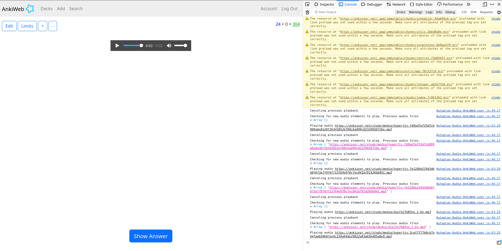

# AnkiWeb Autoplay Audio Userscript

This user script enables autoplay for AnkiWeb almost identical to the native apps. There is only one catch. It doesn't work on the first card, because browsers require users to interact with the page before playing an audio file. It works with multiple audio files (they are played in order one after the other) on both the front and the back side. 
 

## Troubleshooting

Open the developer tools and check if the script is outputting something to the console:
 

